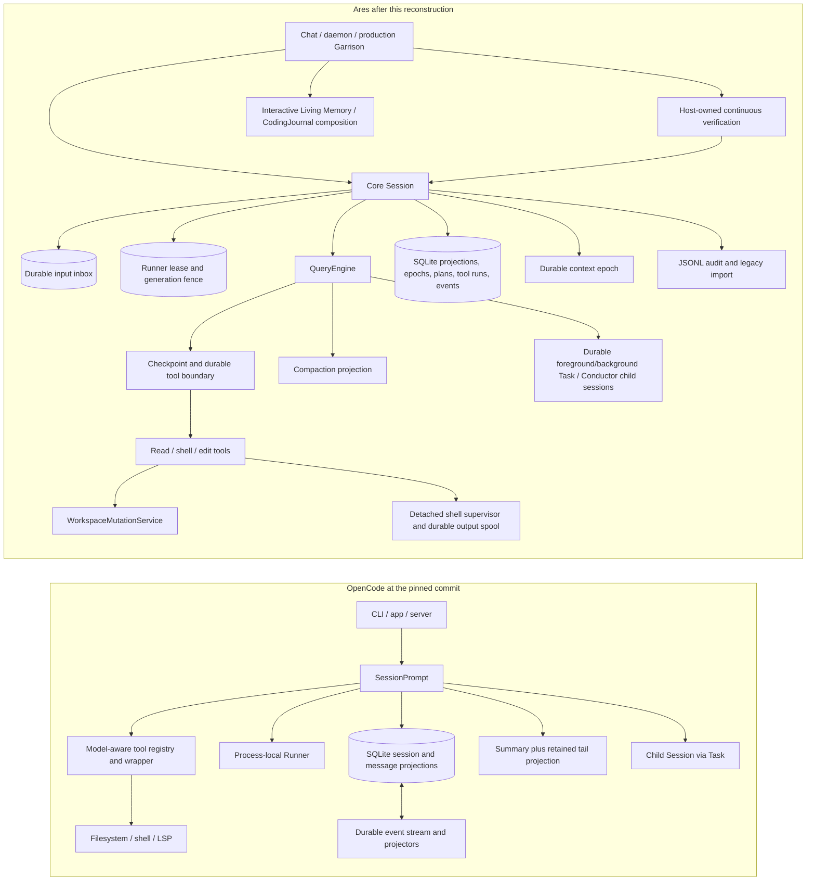

# Coding Harness Architecture: OpenCode and Ares

Status: source audit and reconstruction specification, 2026-08-01

## Executive verdict

OpenCode's long-horizon reliability is architectural. Its model is allowed to be imperfect because the harness continually reconstructs state from durable session data, gives the model a small and predictable tool surface, bounds tool output, preserves a compacted continuation, and represents delegated work as real child sessions. Plan mode is a capability boundary, not merely a sentence in the prompt.

Ares did not primarily lack intelligence or more prompts. Before this reconstruction it had several individually strong mechanisms - checkpoints, a continuous verifier, Living Memory, micro/heavy compaction, subagents, and Conductor - but those guarantees were attached to particular hosts. A direct `QueryEngine`, a fork, a Garrison session, a subagent, and a fleet leaf could take materially different paths. Long-horizon behavior was therefore only as reliable as the weakest path.

The reconstruction changes that center of gravity. Ares now has a workspace-local SQLite session kernel, durable input admission, run generations and leases, tool execution states, context epochs, hash-bound plan revisions, durable child sessions, a recoverable workspace mutation service, complete shell-output spill, and proof-bearing work outcomes. In several areas this is deliberately stronger than the pinned OpenCode implementation.

The core coding-path reconstruction is now implemented across production chat, daemon, Garrison, Task, Conductor, and Operator. Core editors—including explicitly approved files in another project—commit through a recoverable CAS mutation layer at the project the user actually selected. Terminal tool results repair model history after a crash; external effects have typed reconciliation/no-replay contracts; PostToolUse hooks settle as durable child effects; detached Task and shell jobs survive process restart; editors return hash-bound formatter/LSP feedback; child prompts inherit live persona/memory/repository context; and parallel Conductor branches prepare one phase-wide transaction before any branch lands. That still is not a promise that every model decision is correct. The residual boundaries are explicit rather than hidden: arbitrary connector reconcilers remain tool-specific opt-ins, changed symlinks are rejected rather than auto-merged, and harness isolation is not an OS security sandbox against a deliberately authorized process.

## Scope, evidence, and provenance

This document uses three source snapshots:

- **OpenCode** is the exact pinned commit [`19231fce4b70aa5f7894a0a0eb20ff29bd417db5`](https://github.com/anomalyco/opencode/tree/19231fce4b70aa5f7894a0a0eb20ff29bd417db5), checked out under `.ares/research/opencode-source`.
- **Ares-before** is committed baseline `ca48a7f713fa1079af6bbdda7e4a06ebd2622728`. References written as `path@ca48a7f:line` refer to that snapshot.
- **Ares-current** is the reconstruction in this working tree on 2026-08-01. References without a commit suffix refer to the current file.

The labels below are intentional:

- **Observed** means the behavior is directly present in the cited source.
- **Inference** means the source supports an explanation for user-visible reliability, but it is not a benchmark result.
- **Decision** means an Ares architectural choice or a proposed acceptance criterion.

No popularity, reliability-rate, or performance claim is inferred from source code. OpenCode is MIT licensed (`LICENSE` and root `package.json:124`), so direct reuse is legally possible if the license notice is preserved. This reconstruction is described as an architecture-and-contract implementation in Ares abstractions; this document does not claim that OpenCode implementation code was copied. Any future direct port should say so in the affected files and preserve the required notice. Existing component-level provenance notices remain authoritative.

## The architecture at a glance

The important distinction is not SQLite versus JSON. It is whether one lifecycle owns admission, generation, context, tools, effects, verification, and completion across every surface.

| Concern | OpenCode, observed | Ares-before | Ares-current |
|---|---|---|---|
| Canonical session state | SQLite session/message projections plus durable event infrastructure | Asynchronous JSONL rollout and in-memory `Message[]` | SQLite/WAL projections and event ledger; JSONL is an audit and legacy-only compatibility source |
| Input admission | User message and parts saved before the loop | Message appended in memory before any durable admission record | Idempotent SQLite inbox record, monotonic admission sequence, and observer/JSONL barrier before waiting for provider/tool ownership |
| Run ownership | One process-local `Runner` per session | Host-specific busy flags; Core Session had no common queue | Caller-bound input claims plus per-session FIFO, SQLite lease, generation/token fence, heartbeat, expiry recovery, and mid-turn steering |
| Tool lifecycle | Persisted message/tool parts; central schema wrapper | Tool events and checkpoints, but no durable executing/settled ledger | Fenced `proposed -> executing -> terminal` ledger; richer pre-effect states exist but are not asserted before adapter validation/policy actually occurs |
| Editing | Simple Write, locked fuzzy Edit, sequential ApplyPatch | Write used guarded overwrite; Edit wrote directly; no common transaction | Write/Edit/ApplyPatch/FindAndEdit/ApplyIntent/CodeMode and Conductor integration use CAS, stages, backups, journal, rollback/reconcile |
| Shell/output | One platform-selected shell; streaming, timeout/abort, full spill | Bash/PowerShell kept only bounded tails | Foreground shells spool complete decoded interleaved output; detached supervisors own background processes, heartbeat/token state and complete output across host restart; SQLite stores status/PID/output metadata and durable cursors |
| Plan/build | Separate agent permissions, stable plan file, explicit Yes/No exit and synthetic build message | Volatile permission mode; hostless exit could restore writes | Session-scoped living plan revisions, stable artifact, hash-bound approval, atomic synthetic handoff, pinned build context, and no child approval tools |
| Compaction | Overflow checked in the loop; previous summary + bounded recent tail; persisted projection | Micro/heavy compaction existed, but heavy check was turn-start-only and chained recap was clipped | Check at every settled model boundary; full prior recap anchor; current-file re-pin; durable context epochs |
| Subagents | Real child Session; `task_id` continuation; optional detached background job | Fresh fork, summary only, no continuation or propagated work truth | Real verified child Session; `task_id`; parent link; persisted context/debt; `workStatus`; incremental journal; leased detached jobs with restart recovery and exactly-once parent handoff |
| Parallel coding | Ordinary Task shares a workspace; no automatic writer isolation | Conductor used an empty temp directory and weak merge/success semantics | Reboot-stable complete-copy branches, overlap rejection, verified-only leaves, mode-aware manifests, and one phase-wide CAS transaction; changed symlinks fail closed |
| Completion truth | Tool/LSP feedback, but no first-class execution/work split | Strong verifier existed on the interactive path; forks dropped its result | `turn_end.status` is separate from `workStatus`; per-session mutation-generation, behavioral, visual, and spec gates |
| Semantic memory | No core semantic long-term memory was found; instructions/session/summary are the practical memory layers | Living Memory, CodingJournal, and a markdown Memory tool existed outside the session substrate | Living Memory + CodingJournal + markdown Memory; cross-process markdown lease/CAS, exact versions, and typed context-source hashes in durable epochs |

## 1. How OpenCode's coding harness actually works

### 1.1 SQLite projections plus a durable event plane

**Observed.** OpenCode opens SQLite in WAL mode with foreign keys, a 5-second busy timeout, a 64 MiB cache, and `synchronous = NORMAL` (`packages/core/src/database/database.ts:17-31`). It stores sessions and message/part projections in tables rather than reconstructing every read exclusively from an append-only log (`packages/opencode/src/session/session.ts:90-153`, `packages/opencode/src/session/message-v2.ts:425-519`).

OpenCode also has a genuine durable event layer. A durable event is assigned an aggregate sequence; replay at an old sequence must be byte/shape equivalent; divergent replay, duplicate IDs, ownership mismatch, and sequence gaps fail. Projectors, an optional local commit hook, the aggregate sequence, and the event row execute in one immediate SQLite transaction (`packages/core/src/event.ts:205-390`).

That makes the accurate description **projection-oriented persistence with durable events**, not "pure event sourcing." This distinction matters: the hot path reads normalized session/message tables, while events provide ordered durable integration and replay contracts.

### 1.2 One persisted prompt loop

**Observed.** A prompt first creates and saves the user message and all parts, touches the session, and only then enters the response loop (`packages/opencode/src/session/prompt.ts:1022-1070`). Each loop step:

1. marks the session busy;
2. reloads `MessageV2.filterCompactedEffect(sessionID)` from persistence;
3. derives the latest user, assistant, completed turn, and pending tasks;
4. services subtask or compaction work before a normal model call;
5. checks the last finished turn for context overflow;
6. creates and saves the new assistant message before processing it;
7. rebuilds system instructions, skills, MCP instructions, model messages, and the visible tool catalog;
8. streams/processes the assistant response and continues until a terminal result.

The loop is visible at `packages/opencode/src/session/prompt.ts:1081-1202` and `:1213-1339`. The key long-horizon property is that iteration state is not trusted merely because it is still in a JavaScript object. The next step reloads the compacted projection and reasons over durable session history.

### 1.3 Run coordination is good, but process-local

**Observed.** `SessionRunState` owns a `Map<SessionID, Runner>`, exposes `ensureRunning`, `startShell`, `cancel`, and busy/idle state, and removes the runner when it finishes (`packages/opencode/src/session/run-state.ts:35-107`). This prevents two loops in the same process from racing a session and gives cancellation one owner.

It is not a durable cross-process lease in this path. The map disappears with the process. Therefore the source supports "one runner per session per process," not an exactly-once claim across multiple processes.

### 1.4 Why Read, Write, Edit, ApplyPatch, and shell feel dependable

**Observed.** OpenCode keeps the model-facing contract low entropy:

- Every tool is wrapped once. Arguments are decoded through the declared schema, invalid arguments become a consistent tool error, execution is traced, and outputs without tool-specific truncation metadata pass through one truncator (`packages/opencode/src/tool/tool.ts:99-145`).
- Central truncation defaults to 2,000 lines or 50 KiB. The complete text is written to a stable file, and the preview tells the model to use Grep/Read or delegate the file to a Task (`packages/opencode/src/tool/truncate.ts:15-16`, `:85-142`). Large output is context pressure, not lost evidence.
- Read has an intentionally small schema (`filePath`, `offset`, `limit`), pages text under a byte cap, handles directories/media/binary cases, loads relevant instruction files, and can return LSP symbol context (`packages/opencode/src/tool/read.ts:23-67`, `:229-370`). It does not maintain Ares's stateful "already read" refusal.
- Write accepts only `filePath` and `content`, asks permission with a diff, writes through the filesystem service, formats, and reports LSP diagnostics (`packages/opencode/src/tool/write.ts:18-101`).
- Edit serializes by normalized file path with an in-process semaphore, preserves BOM/line endings, tries a layered matching pipeline, and reports a diff and LSP diagnostics (`packages/opencode/src/tool/edit.ts:35-44`, `:69-215`, `:682-720`).
- ApplyPatch exposes one `patchText` field. It parses and computes all file changes before permission, then applies adds/updates/moves/deletes and reports LSP diagnostics (`packages/opencode/src/tool/apply_patch.ts:19-57`, `:193-292`). The writes themselves are sequential; this code does not provide Ares-current's multi-file rollback receipt.
- Shell selects the configured platform shell, parses Bash or PowerShell syntax for command/path permission checks, streams output, merges abort and timeout control, and preserves full truncated output (`packages/opencode/src/tool/shell.ts:257-413`, `:430-591`).
- The registry changes the editing belt by model: the pinned GPT path exposes ApplyPatch and hides Edit/Write; other paths do the inverse (`packages/opencode/src/tool/registry.ts:286-297`).

**Inference.** This combination explains a large part of the "tools rarely fail" reputation. The model sees few fields, bad input fails with a local correction, paths are normalized, concurrent same-file edits serialize, large output remains recoverable, and edit diagnostics arrive in the same result. Reliability comes from reducing ambiguous choices and making failure corrective.

### 1.5 Compaction is a projection, not amnesia by deletion

**Observed.** OpenCode calculates a recent-tail budget, keeps a bounded number of recent turns under that budget, and can split an oversized recent turn (`packages/opencode/src/session/compaction.ts:180-239`). A new summary receives the previous completed summary as an explicit anchor, while already summarized message pairs are hidden from the next summarizer input (`packages/opencode/src/session/compaction.ts:328-354`). The summary is persisted as an assistant message with `summary: true`; a compaction marker records the retained tail (`:356-435`).

`MessageV2.filterCompacted` reconstructs the model view as compaction request, summary, retained tail, and continuation, even though source messages remain available in storage (`packages/opencode/src/session/message-v2.ts:521-598`). Optional pruning replaces old large tool bodies after a protected budget (`packages/opencode/src/session/compaction.ts:243-285`). The main prompt loop checks overflow before another model call and can schedule compaction again after a model result (`packages/opencode/src/session/prompt.ts:1149-1167`, `:1319-1328`).

Compaction is still lossy. It is reliable because the loss is explicit, chained, budgeted, and paired with an uncompressed recent tail - not because summarization is perfect.

### 1.6 Plan mode is capability separation with a concrete handoff

**Observed.** OpenCode defines built-in `build` and `plan` agents. Build can enter plan mode. Plan denies normal editing but allows writes to the designated plan path and permits `plan_exit` (`packages/opencode/src/agent/agent.ts:140-180`). The plan path is stable for the session (`packages/opencode/src/session/session.ts:331-335`).

When the plan agent finishes, `plan_exit` asks an explicit Yes/No question. Yes causes a synthetic user message for the build agent that names the approved plan and instructs it to execute; No stays in plan mode (`packages/opencode/src/tool/plan.ts:15-75`). The richer plan-file reminders are selected through runtime flags, but the separate plan/build identities and explicit approval handoff are not just a prompt convention (`packages/opencode/src/session/reminders.ts:26-89`).

This is why a user can discuss a plan for hours without accidental edits: write authority is removed from the agent's permission set. Build begins through a visible, persisted transition carrying a stable artifact.

### 1.7 Subagents are child sessions, including continuation and background work

**Observed.** Task accepts an optional `task_id`; using it resumes the same child session (`packages/opencode/src/tool/task.ts:43-62`, `:136-172`). A new task creates a normal Session with `parentID`, a derived permission set, its own messages, and its own agent/model. The child is prompted through the same session prompt service (`:197-214`). The parent receives the child's final text and task/session identity.

The pinned source also supports detached background tasks: the call can return a running task record, and completion/error is later injected into the parent as a synthetic message (`packages/opencode/src/tool/task.ts:36-78`, `:216-265`). Session cancellation coordinates background jobs as well (`packages/opencode/src/session/run-state.ts:111-137`).

Ordinary Task does not automatically isolate a writer in a separate worktree. Parent and child normally operate in the same instance/worktree. Its isolation is context and session state, not filesystem ownership.

### 1.8 What OpenCode does not prove

The pinned implementation should be copied selectively, not mythologized:

- the mature run-state path is process-local, not a cross-process lease;
- ordinary Task writers share the parent worktree;
- Write/Edit/ApplyPatch do not provide a durable multi-file rollback journal;
- durable messages do not make arbitrary remote or shell side effects idempotent;
- compaction remains lossy;
- no first-class `executionState` versus proof-bearing `workOutcome` split was found;
- no core semantic long-term memory comparable to Ares Living Memory was found;
- persisted tool/message state improves inspection and continuation, but source alone does not justify a blanket claim that an in-flight external effect is automatically and safely resumed after a crash.

These limitations are useful: Ares should reproduce the successful contracts and retain its stronger verification, recovery, and memory work.

## 2. Ares before the reconstruction

**Observed.** The baseline already contained substantial coding machinery. It was not a blank slate:

- QueryEngine had tool-loop guards, output capping, microcompaction, heavy compaction, checkpoints, mutation detection, continuous-verifier integration, and end-of-turn proof gates (`packages/core/src/queryEngine.ts@ca48a7f:968-1156`, `:1294-1930`).
- Write used `safeOverwrite`, including shrink refusal, backup, and readback (`packages/tools/src/Write.ts@ca48a7f:88-105`; `packages/tools/src/safeWrite.ts@ca48a7f:41-85`).
- Edit had strong read-before-write and matching logic, but committed with direct `fs.writeFile` (`packages/tools/src/Edit.ts@ca48a7f:141-206`).
- Core Session persisted ordered JSONL and flushed before surfacing `turn_end` (`packages/core/src/session.ts@ca48a7f:284-372`, `:426-466`).
- Living Memory and CodingJournal already provided semantic recall and coding evidence outside the session store.

The architectural failure was fragmentation:

1. Core Session appended the user message in memory and immediately called the engine. There was no durable idempotent input record or common run owner (`packages/core/src/session.ts@ca48a7f:263-281`). Two Core Session sends could overlap.
2. `runForkedTurn` directly constructed QueryEngine, seeded it, and streamed it (`packages/core/src/forkedTurn.ts@ca48a7f:31-105`). Task and Operator therefore bypassed Session durability and host verification composition.
3. Production Garrison owned another `QueryEngine` lifecycle and only a host-local busy flag/JSONL replay (`packages/garrison/src/sessions.ts@ca48a7f:167-200`).
4. Tool checkpoints described effects after the fact, but there was no durable `executing` barrier before entering a tool implementation.
5. Bash and PowerShell discarded older output chunks once their in-memory tail filled (`packages/tools/src/Bash.ts@ca48a7f:141-222`). The later engine spill could only save the already truncated result.
6. Plan mode was runtime state. `ExitPlanMode` asked when a prompt channel existed, but a host without one fell through to write mode; no plan revision or approval hash survived restart (`packages/tools/src/PlanMode.ts@ca48a7f:39-69`).
7. Heavy compaction ran before the first model call, not after each tool-heavy boundary, and the next summarization clipped an earlier recap to 1,500 characters (`packages/core/src/queryEngine.ts@ca48a7f:1202-1212`; `packages/cli/src/entry/sessionFactory.ts@ca48a7f:445-471`).
8. Task was prompt-in/summary-out with no `task_id`; fork `workStatus` was not returned through Task or Conductor (`packages/core/src/subagents.ts@ca48a7f:295-424`; `packages/tools/src/Task.ts@ca48a7f:120-152`).
9. Conductor's so-called worktree was an empty temp directory, not a branch of the real owner workspace. It copied files back directly, merged failed leaf output, and considered a phase successful when any leaf completed (`packages/tools/src/Conductor.ts@ca48a7f:48-77`; `packages/core/src/conductor.ts@ca48a7f:966-1031`). Resume state was written only at fleet end (`packages/core/src/conductor.ts@ca48a7f:1645-1663`).
10. The interactive verifier could be strong while delegated/fleet paths dropped the proof result. A completed loop could therefore be mistaken for completed work.

The lesson is precise: **Ares had features; it did not have one enforced harness.**

## 3. Ares after the reconstruction

### 3.1 Canonical session kernel

**Decision.** SQLite is the authority for session lifecycle and recovery. JSONL remains a human-readable audit and a compatibility source only for legacy sessions that have no canonical row.

**Observed.** Schema version 5 contains sessions and parent links, permanent deletion tombstones, admitted inputs, runs, runner leases, messages/parts, mutation transaction IDs on tool runs, context epochs, plan revisions/approvals, workflow mode, ordered session events, and a monotonic per-session admission sequence (`packages/core/src/sessionKernel/migrations.ts`). The database uses WAL, foreign keys, a busy timeout, and `synchronous = FULL`; the code explicitly chooses the stronger side-effect barrier over newest-frame loss under power failure. State-machine mutations use `BEGIN IMMEDIATE` and append their corresponding events in the same transaction. Two-phase session deletion is the deliberate exception: prepare/finalize management writes have tombstone/transaction invariants rather than pretending to be ordinary generation-fenced session events (`packages/core/src/sessionKernel/store.ts`).

The store is workspace-local at `.ares/session-kernel.sqlite` and cached per workspace/process (`packages/core/src/sessionKernel/workspace.ts:5-24`). Child links are first-class and idempotent by parent/relation/external key (`packages/core/src/sessionKernel/store.ts:290-381`).

Canonical authority also applies to the session rail and resume path. List/load/rename/delete query SQLite first. An archived row shadows stale JSON during two-phase cleanup; schema v5 then writes append-only `session_tombstones` for the complete descendant tree in the same `BEGIN IMMEDIATE` transaction that removes the canonical rows. Legacy-only deletion commits the same identity barrier before removing JSON. List, snapshot resume, raw rollout, rename, and Session construction/import all reject a tombstoned ID, while database triggers prevent direct import code from reinserting it. A missing or unreadable `meta.json` cannot hide a live canonical Session, and database open/projection errors surface instead of being converted into an empty list or a legacy fallback (`packages/core/src/session.ts`, canonical session-management functions; `packages/core/src/sessionKernel/migrations.ts`, schema v5; `packages/core/src/sessionKernel/store.ts`, session directory/tombstone operations).

### 3.2 Admission, queueing, lease, and generation fence

**Observed.** Core Session now:

1. inserts an idempotent input record and `input.admitted` event in SQLite immediately;
2. notifies the admission observer, appends the portable `input_admitted` rollout event, and synchronously reserves an in-process ticket in database admission order without waiting on it;
3. flushes the audit and only after that write-ahead boundary waits for the reserved execution slot;
4. rechecks idempotent settlement after the wait, then acquires a runner generation and claims **that sender's input ID**, never a global-oldest input; global FIFO selection is reserved for explicit recovery and uses the database admission sequence rather than timestamps or caller-chosen IDs;
5. appends the durable user-message projection, enters QueryEngine, and consumes the caller's input only after a terminal `completed` turn;
6. releases the lease, requeueing every unconsumed claim after interruption/failure.

The send flow is `packages/core/src/session.ts:381-515`; caller-bound claim and deterministic recovery/steering selection are `packages/core/src/sessionKernel/store.ts:446-598`. `input_admitted` is an observer/audit event rather than a yielded turn-stream event; Garrison also defensively suppresses a mirrored duplicate (`packages/garrison/src/sessions.ts:123-125`, `:199-216`, `:429-434`). One regression holds provider A open and proves B is already present in SQLite, the observer, and JSONL without overlapping execution; a second deliberately stalls A's audit flush until B's later audit has completed, then proves execution still follows admission sequence and each generator streams only its own durable input (`packages/core/src/sessionKernel/sessionIntegration.test.ts:125-310`). Lease acquisition increments a generation and creates a unique token; all writes assert session, generation, token, and expiry. Release requeues claims and records execution state separately from work outcome.

**Observed.** `delivery = steer` now has real runtime semantics. While a generation is active, QueryEngine polls at iteration edges, after a no-tool model response, and immediately after a fully settled tool-result batch (`packages/core/src/queryEngine.ts:997-1038`, `:1464`, `:1799-1803`, `:2172-2180`). Core Session uses `claimSteeringInputs`, commits each stable user-message projection, QueryEngine installs those messages without ID duplication, and only then acknowledges the inputs (`packages/core/src/session.ts`). Thus a correction arriving during a provider stream or tool effect waits for the next safe boundary; it never starts another provider/tool loop. Queue inputs and user steering inputs are independently FIFO, with a pending user steer taking the next free generation; after an acknowledgement fault, the steering caller can replay its own correction without stealing or being permanently wedged behind the failed queue input. Synthetic approved-plan handoffs are attached control inputs rather than caller-owned work: they do not own the admission head, and the next real build generation drains, pins, and consumes them before model execution. Fault tests cover concurrent duplicate submission, plan-handoff restart, and a failure between history installation and acknowledgement: the unconsumed claim is requeued, the stable message is reused, and exactly one `input.consumed` event is committed (`packages/core/src/sessionKernel/sessionIntegration.test.ts`; `tests/plan-build-handoff.test.mjs`).

The daemon protocol carries the same stable `inputId`. Desktop sends generate it once and retain it across daemon restart/retry; a duplicate settled send is acknowledged without another provider call, while a send during an active turn is admitted through the steering path. The daemon no longer fabricates a timeout-based `turn_end` that could free the UI while an effectful tool was still unwinding (`tauri/src/App.tsx`; `tauri/src-tauri/src/main.rs`; `packages/cli/src/entry/daemon.ts`).

**Operational lease timing.** Core Session defaults to a 30-second runner lease
with a 10-second heartbeat, so a process crash leaves a short takeover delay
instead of the former hardcoded five-minute stall. Set
`ARES_SESSION_LEASE_TTL_MS` to change the expiry window and
`ARES_SESSION_LEASE_HEARTBEAT_MS` to change renewal cadence. TTL is clamped to
250ms..5min; heartbeat is clamped to 50ms..min(60s, TTL/3), guaranteeing at
least two renewal opportunities per lease. `SessionOptions.sessionLeaseTtlMs`
and `sessionLeaseHeartbeatMs` override the environment for embedders and tests.
Expiry never weakens authority: takeover increments the generation, marks any
old executing effect unknown, requeues its input, and every late write from the
old generation still fails its token fence.

`RunLeaseCoordinator` now owns wait/wake coalescing, heartbeat, fenced release, expiry takeover, and reconciliation around the SQLite lease (`packages/core/src/sessionKernel/coordinator.ts`). Core Session uses that coordinator rather than carrying a second lease state machine.

Core Session also reserves startup recovery ahead of any caller that can obtain the new instance. Canonical admitted inputs and expired claimed inputs are drained in admission order; a healthy prior lease is waited out rather than raced. Consumption and a detached-result acknowledgement commit atomically, with the response body referenced from the canonical message projection, so a dead caller cannot strand queue head or cause a later sender to receive its stream (`packages/core/src/session.ts`; `packages/core/src/sessionKernel/store.ts`). Recovery begins when the canonical Session is opened; dormant database rows are not executed without a host-provided provider/tool composition.

Production Garrison now constructs Core Session with the shared workspace kernel and a per-remote-session `ContinuousVerifier`; its completion barrier settles pending checks and applies the same proof gate as interactive chat. A legacy manager factory remains useful for deterministic tests, but an unhosted effectful `QueryEngine` is no longer a production-capable seam: callers must supply both durable barriers through `QueryEngine.hosted`, or explicitly opt into `forTesting` (`packages/cli/src/entry/garrisonCmd.ts`; `packages/garrison/src/sessions.ts`; `packages/core/src/queryEngine.ts`).

### 3.3 Durable tool boundary and crash classification

**Observed.** QueryEngine exposes two host barriers: `beforeToolExecution` must settle before a tool receives authority, and `afterToolExecution` must settle before `tool_end`/`tool_error` is exposed (`packages/core/src/queryEngine.ts:238-257`). Core Session truthfully maps the currently observable host boundary to durable transitions:

`proposed -> executing -> succeeded | failed | effect_unknown`

The store supports `validated`, `authorized`, and `checkpointed`, but Core Session does not manufacture those claims. The adapter marks only parse, semantic-validation, permission-policy, and permission-prompt failures as definitely pre-effect. Once an implementation has been entered, a thrown non-read-only call is `effect_unknown` unless the tool returns a structured known failure. PreToolUse shell hooks run inside the checkpoint and durable boundary; if one ran before blocking or throwing, the call is also classified unknown rather than replay-safe. A completed implementation can return `EngineToolResult.failure` with its structured output: the engine records `failed`, preserves the output and failure in the ledger, emits an error result to the model, and does not misclassify the call as succeeded. That distinction is what lets a foreground shell timeout be known-failed while retaining its partial output (`packages/tools/src/_shared.ts`; `packages/core/src/queryEngine.ts`).

For the transactional coding editors, QueryEngine derives a stable mutation transaction ID from session/tool-use identity and persists it with the tool run. On recovery—or immediately after an ambiguous throw—Session asks `WorkspaceMutationService.reconcile`: `fully_applied` becomes succeeded-but-unverified without replay, `not_applied` becomes failed/pre-effect, and mixed/diverged state remains blocked/unknown. This closes the blind-retry window for Write/Edit/ApplyPatch/FindAndEdit/ApplyIntent/CodeMode. It does not generalize to shell, deploy, payment, messaging, or other remote effects.

Crash projection uses terminal `tool_runs` as the authority for a missing model-visible pair. Failed runs include both their failure text and any structured result, so a crash after shell settlement cannot erase stdout, stderr, exit code, timeout state, or `fullOutputPath` and tempt the model into rerunning merely to recover diagnostics. If the final assistant message itself reached SQLite before `turn_end`, resume hydrates the canonical projection and inserts a deterministic recovery boundary instructing the model to finalize or continue only explicitly unresolved work; already settled effects remain paired and are not replayed (`packages/core/src/session.ts`, `projectMessagesFromKernel` and `restoreKernelResumeBoundary`).

If a lease expires, the next acquisition marks tools that reached `executing` as `effect_unknown`, fails pre-effect states, requeues claimed inputs, interrupts the old run record, and deletes the old lease (`packages/core/src/sessionKernel/store.ts:1267-1309`). It does not blindly call the tool again.

PostToolUse hooks now participate in the same truthful boundary. Each resolved hook has a stable identity and its own synthetic durable tool run; it is checkpointed, admitted, executed, and settled before the primary terminal result is exposed. Hook-touched files join proof accounting, while a hook failure remains distinct from the already-completed primary effect. Direct construction rejects executable hooks or non-read-only tools; the production factory requires both write-ahead and terminal-settlement callbacks, and dynamically selected effectful tools are checked again before implementation entry (`packages/core/src/hooks.ts`; `packages/core/src/queryEngine.ts`; `packages/core/src/session.ts`).

### 3.4 Transactional and recoverable workspace mutation

**Decision.** Editing reliability belongs below individual tools. A model-facing tool may decide *what* to change; one service owns path resolution, optimistic concurrency, staging, commit evidence, and recovery.

**Observed.** `WorkspaceMutationService` accepts add/update/delete/rename operations and:

- constrains paths to the selected transaction root and protects its own journal;
- acquires normalized cross-process path leases in stable order and reclaims only PID-proven dead owners;
- reads each base through a stable file handle and prevalidates hash, mode, and filesystem generation before changing a user path;
- writes and fsyncs backups and same-directory stages;
- journals every transition under `.ares/mutations/<transaction>/journal.jsonl`;
- installs and restores with create-if-absent semantics, verifies ownership/generation, writes a committed receipt, and cleans stages;
- automatically restores before-states on a normal commit failure without overwriting a newer editor generation;
- provides explicit `rollback(transactionId)` for committed receipts and `reconcile(transactionId)` for incomplete/diverged on-disk state.

The public contract and apply path are `packages/core/src/workspaceMutation.ts:14-115`, `:220-350`; rollback/reconcile are `:353-468`; validation/materialization/commit are `:475-708`; journal fsync is `:1128-1165`.

ApplyPatch has one compact patch field, validates all paths, computes every resulting file before mutation, preserves BOM/line endings, and submits one transaction (`packages/tools/src/ApplyPatch.ts`). Write retains the catastrophic-shrink guard and user-visible backup; Edit retains matching/read-stamp behavior; both choose the active workspace or the explicitly approved external project's nearest root and commit directly there. FindAndEdit builds one operation batch, ApplyIntent submits generated content through the service, and CodeMode keeps every VM write in an overlay until the script exits successfully, then commits the entire staged set once (`packages/tools/src/FindAndEdit.ts`; `packages/tools/src/ApplyIntent.ts`; `packages/tools/src/CodeMode.ts`). Conductor phase integration and markdown Memory use the same service (`packages/tools/src/Conductor.ts`; `packages/tools/src/Memory.ts`). These claims cover the core coding/file editors, not arbitrary shell commands or external connectors.

Every core editor now passes its committed receipt through one hash-bound post-mutation feedback service. It discovers only explicit/known Prettier, Biome, ESLint, TypeScript, Ruff, rustfmt/Cargo, and gofmt/Go configurations; runs bounded check-only commands without a shell; rechecks file hashes before and after; and returns formatter/type/lint feedback without rolling back a valid edit. External approved files discover tooling from their own project rather than the startup workspace (`packages/core/src/postMutationFeedback.ts`; `packages/tools/src/postMutationFeedback.ts`). ContinuousVerifier remains the stronger end-of-turn proof gate; immediate feedback shortens the repair loop.

This is recoverable multi-file commit, not a claim that a normal filesystem can atomically rename several unrelated paths at one instant. Cooperating Ares writers serialize through leases; non-cooperating editors are fenced by content/mode/file identity and exclusive install. If safe restoration is impossible, both the user path and recovery artifact survive under an explicit reconciliation-required state rather than being overwritten.

### 3.5 Read, shell, output, and provider schema reliability

**Observed.** Ares Read streams text with bounded retained memory, computes a full-file SHA-256 and line count, pages under a 50 KiB/line-count ceiling, caps pathological single lines explicitly, lists directories, returns supported images through the model's vision channel, and reports unsupported binary encodings without dumping bytes into context (`packages/tools/src/Read.ts`). PDFs use a lazy-loaded, bounded pdf.js extractor: at most eight pages and 50 KiB are returned per call, page offsets continue the document, scanned/image-only pages are identified, and the exact source hash/stat is still recorded. A read stamp is per-Session concurrency evidence for a later edit and for rejecting an impossible offset; it is cleared when compaction removes the model-visible evidence. Text/PDF pages are explicit projections, not byte-for-byte attachments.

Path-scoped repository instructions now follow file access rather than startup alone. The Session-local resolver walks workspace root to the target directory, applies one same-directory convention by deterministic precedence, versions claims by full-content SHA-256, re-injects changed rules, attaches newly relevant rules to Read/directory results, and makes declared editors and shells return a known pre-effect correction once so the model sees those rules before retrying the mutation. Bash and PowerShell share one cwd/timeout/background/target schema; their declared cwd and concrete `target_paths` participate in path permission and nested-rule discovery before process spawn. Claimed rules are re-read and pinned during compaction; parent and child Sessions do not share claims (`packages/core/src/repositoryInstructions.ts`; `packages/tools/src/_shared.ts`; `packages/tools/src/Read.ts`). An intentionally opaque command can still access an undeclared absolute path under the user's granted machine authority; the harness cannot infer arbitrary shell semantics.

Bash and PowerShell create a foreground capture before spawn and stream UTF-8 through split-safe decoders. Capture backpressure pauses the producing stream; inline values retain bounded tails; any raw-chunk eviction sets truncation truth; the complete tagged text capture path is retained only when truncation occurred, and a capture failure is reported explicitly rather than silently claiming completeness. Foreground non-zero exits and timeouts return the same structured result plus an explicit failure marker; QueryEngine sends that object to the model as `is_error` and settles the durable run as failed. Successful foreground exit zero and successful background launch remain normal successes. Session checkpoint-diffs both declared and thrown shell errors, attaches any discovered files to `tool_error`, emits the workspace diff, and carries the mutation into CodingJournal and verifier debt; a command cannot erase an earlier write merely by failing afterward. Independently, QueryEngine spills any oversized model-facing tool result to `.ares/tool-results/<session>/<toolUseId>.txt`.

Background execution no longer depends on reconstructing a Node `ChildProcess`. A detached `ShellSupervisor` owns the command and its pipes, writes split-safe tagged output to an append-only spool, and publishes token-bound PID/child-PID/heartbeat/terminal state atomically. Schema-v6 `background_jobs` records stable invocation identity, session ownership, process/output metadata, result/error and terminal truth; `background_job_cursors` advances by CAS only after a successful spool read, so restart cannot skip or replay acknowledged output. A replacement `ShellRegistry` validates the token and fresh heartbeat, reconciles completed/failed/cancelled state, can kill the recovered process tree, and injects one idempotent parent completion at the next safe steering boundary (`packages/tools/src/ShellSupervisor.ts`; `packages/tools/src/ShellRegistry.ts`; `packages/core/src/sessionKernel/migrations.ts`).

The OS boundary remains honest: Node cannot reconstitute an old pipe object, and an ungracefully killed supervisor can leave no terminal state write. Ares therefore preserves the external spool and classifies a dead/stale, unproven identity as `orphaned`; it never fabricates an exit code. The detached supervisor is the continuity mechanism, not claimed pipe reattachment.

OpenAI-shaped providers now receive a conservative schema subset: unsupported unions/logic are narrowed while descriptions preserve the broader runtime capability (`packages/core/src/providers/toolSchema.ts:1-44`, `:47-112`; integrations at `packages/core/src/providers/openrouter.ts:352-353`, `openaiResponses.ts:399-411`, `ollamaCloud.ts:249-250`). This prevents one incompatible tool schema from rejecting the entire belt.

### 3.6 Compaction and durable context epochs

**Observed.** Ares retains its two-rung compactor:

- at roughly 60% of the heavy threshold, old re-derivable tool-result bodies become placeholders without a model call; corresponding Read stamps are invalidated (`packages/core/src/queryEngine.ts:1001-1084`);
- above the threshold, older messages are summarized, the recent tail remains exact, up to five recently touched small files are reread and pinned from current disk state, and the prior span is replaced with the recap (`:1087-1182`).

The reconstruction makes context a loop invariant. Both rungs run before the first provider call and again at every settled model boundary, after tool pairs are complete and no effect is in flight (`packages/core/src/queryEngine.ts:1228-1239`, `:1392-1405`). The summarizer now carries a complete prior compaction recap rather than clipping its anchor on every generation (`packages/cli/src/entry/sessionFactory.ts:433-471`).

Heavy compaction creates a durable context epoch containing the summary, exact model projection, source versions, last stored message ordinal, and token count. Resume starts from that projection and appends only message records after its source ordinal (`packages/core/src/session.ts`; `packages/core/src/sessionKernel/store.ts`). Repository instruction bodies/hashes are re-pinned into the compacted projection, and approved plan bytes are independently pinned in the system context.

Each durable epoch records the protocol/projection/ordinal plus host-supplied hashes for the system prompt, persona, full tool catalog, Living Memory/git prompt tail, CodingJournal, and Operator goal context. Interactive, Garrison, Task, Conductor, and Operator compositions all provide an explicit compiler identity and source manifest (`packages/core/src/session.ts`; `packages/cli/src/entry/sessionFactory.ts`; `packages/cli/src/entry/garrisonCmd.ts`; `packages/core/src/subagents.ts`; `packages/core/src/conductor.ts`; `packages/operator/src/dispatcher.ts`). Microcompaction now emits and synchronously persists the exact reduced projection before the next provider call, so restart cannot re-inflate cleared tool bodies or change the token footprint.

### 3.7 Durable plan-to-build state

**Observed.** Workflow mode is stored on the session, so restart cannot silently turn a planning conversation back into write mode (`packages/core/src/sessionKernel/migrations.ts:210-217`; `packages/core/src/sessionKernel/store.ts:390-402`). Plan revisions have exact body bytes, a hash, a state machine, and one executing revision. Approval records repeat the hash; execution refuses an approval for different bytes (`packages/core/src/sessionKernel/store.ts:1039-1197`).

Entering plan mode now creates or recovers a durable draft immediately. `UpdatePlanDraft` replaces the complete living markdown body after material discoveries; identical saves heal the projection without revision churn, changed bytes create a new hash-bound revision, and the draft survives restart/compaction. `ExitPlanMode` can submit those exact active bytes without recopying them, or accept an explicit final replacement. Without a host approval channel it stays in plan mode; an allow decision approves the exact body and only then restores build authority (`packages/tools/src/PlanMode.ts`; `packages/core/src/session.ts`).

The interactive and Garrison compositions restore per-session plan posture, recompose the prompt after mode changes, and route start/update/proposal/approval through the owning canonical Session (`packages/cli/src/entry/sessionFactory.ts`; `packages/cli/src/entry/sessionPlanModes.ts`). Enter is pinned whenever canonical workflow is build; Update/Exit are pinned whenever it is plan, independent of keyword intent. All three owner workflow tools are stripped from Task, Conductor, and Operator children. The remote approval policy always asks for Exit rather than letting unattended autonomy self-approve. The first non-plan-safe write after approval moves the revision to `executing`; verified completion or a failed/blocked run settles it.

Each active revision is also projected atomically to one stable human-readable `.ares/plans/<session>.md`; its metadata names the immutable revision ID and SHA-256 while SQLite remains authoritative (`packages/core/src/planArtifact.ts`). Exact approval is idempotent. Approval, durable `workflow_mode = build`, and admission of a deterministic synthetic steering input commit in one `BEGIN IMMEDIATE` transaction (`packages/core/src/sessionKernel/store.ts`). The handoff carries revision ID, revision number, hash, artifact path, and exact body. It is installed at the next settled model boundary and consumed only after history installation; the same handoff is also appended to the system prompt while the approved revision is `approved` or `executing`, so compaction cannot erase the build contract. A non-read-only tool is rejected at the Session boundary whenever workflow remains `plan` or the active revision is still draft/awaiting approval (`packages/core/src/session.ts`).

### 3.8 Durable subagents, Conductor, and Operator workers

**Observed.** Ares Task now accepts `task_id`, links a child to its parent in the kernel, validates parent/type on continuation, and runs a real Core Session. Resume hydrates the child's projected messages and Todos, then admits a new idempotent child input (`packages/tools/src/Task.ts:64-166`; `packages/core/src/subagents.ts:318-407`, `:491-572`). The result returns loop status and proof-bearing `workStatus` separately. A live `SubagentJournal` records events incrementally before the final convenience transcript (`packages/core/src/subagents.ts:354-362`, `:424-488`).

Task also supports `run_in_background`. The foreground tool returns stable `jobId`/`taskId` immediately; `TaskOutput` and `KillTask` expose session-owned status and durable cancellation. SQLite worker leases prevent healthy hosts from racing the same job, expiry lets a replacement runner take ownership, and the child's stable admitted input prevents duplicate provider execution if the first host died after doing the work but before settling the outer job. Terminal result plus a synthetic parent steering input commit atomically; its idempotency key installs the completion exactly once at the parent's next safe boundary, while an idle parent completion is explicitly excluded from caller FIFO ownership so it cannot deadlock a later real input (`packages/core/src/subagents.ts`; `packages/tools/src/Task.ts`; `packages/core/src/session.ts`).

Task, Conductor, Operator, and Garrison durable sessions share one production child composition and verifier boundary (`packages/core/src/childSessionComposition.ts`; `packages/core/src/childSessionVerifier.ts`). Every child Session owns a `ContinuousVerifier` rooted at that child's workspace or isolated branch, receives workspace hooks plus live context-source hashes, and follows an explicit lifecycle cleanup policy. Both successful and failed-after-writing tool events schedule `touchedFiles`; the end gate settles the verifier and exposes its evidence generation. Terminal tool settlement records affected paths and scope completeness in SQLite `session_mutations`; a resumed red child schedules unresolved canonical scope into a **new** verifier generation. JSONL is never restart authority, and an upgraded/legacy red row without canonical scope remains fail-closed. Neither an old child pass nor a green sibling can certify it. Read-only/research children legitimately remain `not_applicable`. Conductor's work contract then makes a red/unverified branch ineligible for merge. Session-local Read evidence, nested-instruction claims, Todo state, and foreground/background shell registry references are not shared between ordinary interactive children; Garrison resolves the same state explicitly by canonical session ID.

Conductor leaves also become durable child sessions when a kernel is supplied. Parallel build isolation copies the owner's tracked, untracked, dirty, and mode-bearing regular-file state while excluding `.git` and `.ares`. Dependency trees are independently materialized per branch with filesystem reflink/copy-on-write where available and byte-copy fallback; package-manager links are rewritten to branch-local targets, escaping links fail closed, and restart validates dependency-root digests before resuming (`packages/tools/src/Conductor.ts`; `packages/core/src/conductor.ts`). A complete phase prepares every verified leaf and commits all project operations through one CAS transaction, so one stale/overlapping branch lands none of them. Changed project symlinks remain an explicit pre-merge rejection. This is strong harness-created isolation, not an OS filesystem namespace against a process deliberately authorized to create a new absolute link.

Production assigns each copy branch a deterministic key derived from fleet,
repair attempt, phase, and leaf slot. Its base-hash manifest and branch bytes
live under the owner workspace's `.ares/conductor-branches/<digest>/`, which is
excluded from workspace snapshots. The same path is reopened after process
restart or machine reboot instead of creating an empty sandbox after the
durable child input has already settled. Per-entry copying structurally skips
`.ares`, preventing the branch store from recursively copying itself. Merge
uses a stable transaction id and recognizes bytes already at the intended
after-state, which closes the crash window between mutation commit and phase
checkpoint. Durable branch teardown is now behind both sides of that boundary:
the branch must integrate cleanly, then the exact selected phase/repair attempt
must be atomically represented in `.ares/fleets/<fleet>/leaves.json`. Conflicts,
partial integration, unverified leaves, abandoned/superseded repair attempts,
and checkpoint-write failure retain both branch bytes and `base.json` for
deterministic reopen; a checkpoint failure also fails the fleet rather than
reporting durable completion. Direct library callers that omit a durable key retain
disposable OS-temporary `mkdtemp` behavior, and explicit scoped `cleanup()`
remains available after an owner has reconciled a retained branch.

Before merging, Conductor refuses unenumerable branches and cross-leaf path overlap. A build leaf is mergeable only when its loop completed **and** its child-local `workStatus` is `verified`; `unverified`, `blocked`, failed, and interrupted writers remain isolated and make the phase fail under the default `all` policy. Merge failures are recorded and resume state is persisted at phase boundaries (`packages/core/src/conductor.ts`, `leafMeetsWorkContract`, isolated integration, and phase persistence). The public type/comment still says "worktree," but the production implementation is copy-based, not `git worktree`.

Kernel-backed Operator steps are durable child Sessions too. They use the same child verifier and restored debt projection, persist `workStatus` into the goal step record, and refuse to advance or complete a goal on red/unverified worker output. A later high-level reality probe cannot overwrite that red coding proof; read-only steps remain `not_applicable` and do not manufacture verifier work (`packages/operator/src/dispatcher.ts`; `packages/operator/src/controlLoop.ts`; `packages/operator/src/goal.ts`).

### 3.9 Proof-bearing completion

**Observed.** Ares preserves the architectural advantage OpenCode does not expose as a first-class state: execution termination and work truth are separate.

- `turn_end.status` is `completed | interrupted | failed`.
- `turn_end.workStatus` is `verified | unverified | blocked | not_applicable` (`packages/protocol/src/types.ts:193-210`).
- ContinuousVerifier increments a mutation generation, coalesces checks, records the latest run generation/status/strength, and distinguishes syntax/static/behavioral evidence (`packages/core/src/verifier.ts:78-91`, `:127-220`, `:346-478`).
- QueryEngine accepts completion only when evidence is newer than the mutation, behavioral when required, free of a later manual failure, and visually newer for windowed GUI work (`packages/core/src/queryEngine.ts:1300-1380`, `:1794-1971`).
- Session discovers opaque shell/CodeMode mutations from checkpoints, fails closed to an unknown-mutation sentinel when it cannot diff, and upgrades otherwise-empty work status only from fresh verifier evidence (`packages/core/src/session.ts:621-704`).
- Garrison, Task, Conductor, and durable Operator workers own verifier composition instead of inheriting a green result from another host or sibling; their proof outcome remains separate from loop termination (`packages/cli/src/entry/garrisonCmd.ts`; `packages/core/src/childSessionVerifier.ts`; `packages/tools/src/Task.ts`; `packages/core/src/conductor.ts`; `packages/operator/src/dispatcher.ts`).

This is the right direction: long-horizon coding fails when a harness confuses "the agent stopped" with "the requested behavior is proven."

### 3.10 Memory layers

**Observed.** Ares has four distinct memory surfaces:

1. **Conversation memory:** canonical messages, tool results, and context epochs in the session kernel.
2. **Coding state:** CodingJournal tracks touched files, verification debt/scope, spec documents, and recurring failure signatures (`packages/core/src/codingJournal.ts:28-65`, `:177-224`, `:286-340`).
3. **Semantic/procedural memory:** Living Memory is loaded into the system prompt under a token budget, queried on repeated failure signatures, recalled per turn, and updated by post-turn consequence (`packages/cli/src/entry/turnPipeline.ts:90-92`, `:169-229`, `:274-338`, `:345-421`).
4. **Model-addressable markdown memory:** the default `Memory` tool directly reads and rewrites project/user memory markdown (`packages/tools/src/Memory.ts`).

The markdown Memory surface is now concurrency-safe rather than an unguarded read-modify-write. Project and user memory take an adjacent cross-process lease, commit through `WorkspaceMutationService` at the actual workspace or Ares home, expose the exact SHA-256 version, and accept an optional expected version so stale writers receive an explicit conflict instead of losing another session's update (`packages/tools/src/Memory.ts`). Durable context epochs hash the interactive memory/git tail and CodingJournal; the shared child composition reloads persona, Living Memory, git/repository context, hooks, summarization, and canonical verifier debt with only explicit surface-policy differences (`packages/core/src/childSessionComposition.ts`).

## 4. Crash and consistency invariants

These are the contracts that make long-horizon coding testable. "Current boundary" is important: an invariant is not global until every host uses it.

| ID | Required invariant | Ares-current enforcement | Current boundary |
|---|---|---|---|
| K1 | No provider call or tool effect before input is durable | SQLite `admitInput`, then JSONL flush, then run acquisition | Core Session with kernel |
| K2 | At most one authoritative generation writes a session | lease row + generation + unique token + expiry assertion | All production effectful surfaces; an unhosted engine is read-only or explicitly test-only |
| K3 | A tool is durably `executing` before its implementation starts | QueryEngine pre-effect callback to fenced tool-run state machine | Session-hosted QueryEngine only |
| K4 | A primary tool result and its PostToolUse children settle before success/error is exposed | QueryEngine awaits primary and synthetic hook settlement before event/model result | Session-hosted QueryEngine |
| K5 | A crash in an effect window never becomes an automatic retry | expired executing calls become `effect_unknown` | Recovery happens on the next lease acquisition |
| K6 | Failed/interrupted attempts do not burn user input | only completed turns consume; release/expiry requeues claims | Kernel inbox |
| K7 | A stale owner cannot append messages/events or settle tools | every store write asserts generation, token, and unexpired lease | Kernel store |
| K8 | Compaction restart does not duplicate or re-inflate the retained projection | heavy and micro context epochs store the exact projection + last source ordinal before another provider call | Kernel-backed Session |
| K9 | Plan approval applies to exact bytes | SHA-256 plan hash repeated in approval and checked at execution | Kernel plan workflow |
| K10 | Multi-file edit failure is inspectable and reversible | prevalidation, CAS, backup/stage, fsynced journal, rollback/reconcile | Core coding/file editors routed through WorkspaceMutationService |
| K11 | Loop completion cannot imply behavioral completion | independent execution state and work outcome | Interactive, Garrison, Task, Conductor, and Operator production compositions |
| K12 | JSONL failure cannot silently replace canonical state | SQLite commits synchronously; JSONL is audited and flushed at admission/turn end | Core Session |
| K13 | One sender cannot execute or stream another sender's request | sender calls `claimInput(inputId)`; only explicit recovery uses global FIFO | Kernel-backed Session |
| K14 | Mid-turn correction is neither lost nor applied twice | fenced steer claim, stable durable message ID, history-before-ack, idempotent consume | Kernel-backed Session + QueryEngine |
| K15 | Build authority and build context refer to the same approved bytes | one transaction commits exact approval, build mode, and deterministic handoff; system context pins ID/hash/body until plan settlement | Kernel-backed Session plan workflow |
| K16 | A settled effect cannot disappear from model history after a crash | terminal tool ledger repairs a missing result pair; final-assistant recovery adds a deterministic continuation boundary | Kernel resume projection |
| K17 | A failed command cannot erase mutations it made before failing | structured failure result + checkpoint diff + `tool_error.touchedFiles` + CodingJournal/verifier debt | Shell and opaque checkpointed tools |
| K18 | A completed but unverified fleet writer cannot merge | per-child verifier evidence and `leafMeetsWorkContract` gate before isolated integration | Kernel-backed Conductor build leaves |
| K19 | One child or sibling cannot lend stale proof to another | one verifier per child workspace; mutation/evidence generations; red-debt reschedule on restart | Durable Task/Conductor/Operator child Sessions |
| K20 | Finalized canonical or legacy Session deletion cannot resurrect stale/restored JSON or be re-imported | append-only SQLite tombstone, atomic tree finalization, create/import guard, and database trigger | Canonical session management |

## 5. Explicit boundaries after reconstruction

The audit's admission, orphan recovery, plan/build handoff, model-visible crash repair, core-editor routing, bounded Read/PDF extraction, child verification, canonical mutation scope, effect reconciliation, PostToolUse settlement, durable background work, formatter/LSP feedback, child prompt inheritance, context-source versioning, phase-atomic branch settlement, dependency isolation, external-editor fencing, microcompaction persistence, and markdown-memory concurrency defects are closed. Kernel inputs commit before the FIFO wait, every live sender is bound to its own input ID, exact approval atomically creates build authority plus its handoff, every core coding editor commits directly at the project the user selected, and only verified fleet writers can integrate.

No directory jail was added. Ares separates **freedom** from **truthful settlement**: the user can authorize work in any directory, while core editors still use the target project's transaction journal and opaque commands remain explicit about what the harness can and cannot prove.

| Boundary | Current behavior | Why it is explicit |
|---|---|---|
| Connector-specific external effects | A tool may supply an observational reconciler and retry contract. Otherwise an interrupted entered effect stays `effect_unknown` and blocks blind replay. | A generic harness cannot infer whether a payment, publish, message, or deploy happened. |
| Arbitrary shell authority | Bash/PowerShell share one schema and load nested repository rules for declared `cwd`/`target_paths`, but an authorized opaque command can intentionally access undeclared absolute paths. | This preserves the user's requested machine/directory freedom; the harness is not an OS security namespace. |
| Changed project symlinks | Conductor rejects changed symlinks before owner mutation; dependency links are independently materialized or rejected when they escape the branch. | Automatic symlink merge would require a first-class transactional link operation, not a byte-file guess. |
| Background process after machine reboot | Task jobs are lease-restartable. A detached shell supervisor survives an Ares host/app restart and retains full output; if the OS kills it or the machine reboots, it becomes explicit `orphaned` rather than being launched a second time. | Replaying an arbitrary command after losing process identity can duplicate irreversible effects. |
| Scanned PDFs | Read extracts bounded text pages and reports image-only/scanned pages; it does not invent OCR text. | OCR is a separate lossy capability and should be exposed deliberately. |
| Filesystems without stable file identity | WMS combines cross-process path leases, stable handles, content/mode/mtime checks, and exclusive install. On a filesystem that exposes no stable identity, uncertainty remains a recoverable conflict. | Conflict is safer than silently overwriting a non-cooperating external editor. |
| Explicit test escape hatch | `QueryEngine.forTesting` may bypass durable production ownership for deterministic unit/evaluation harnesses. | The name makes the boundary auditable; user-facing surfaces use hosted Session composition. |

## 6. Fault-injection acceptance suite

Architecture parity is not established by a feature checklist. It is established when these deterministic crash tests pass:

1. **Admission crash:** terminate after SQLite admission and after JSONL admission, before provider start. Restart must run one logical input once; resubmitting its idempotency key must not duplicate it.
2. **Caller-ownership race:** stall sender A's audit after durable admission until B's later audit finishes. Execution must still follow admission sequence, each sender must claim/stream only its own input, and recovery order must remain deterministic despite timestamp ties and reverse-sorted IDs.
3. **Steering crash:** admit duplicate steering while a provider stream and while a tool effect are active; inject a failure after history installation but before acknowledgement. The active generation must apply the correction only at a settled boundary, commit one stable message and one consume event, and requeue any unacknowledged claim.
4. **Lease race:** run two processes against one session. Only one generation may claim or append; after TTL expiry, the old token must fail every write.
5. **Pre-effect crash:** terminate in each tool state before `executing`. Recovery must mark it failed/not-required and requeue the input without a side effect.
6. **Ambiguous-effect crash:** terminate immediately after entering a non-read-only implementation. Recovery must mark `effect_unknown`, never auto-retry, and require the tool reconciler.
7. **Post-effect/pre-result crash:** commit a file mutation and terminate after tool settlement but before model-visible `tool_end`. Resume must synthesize exactly one matching tool result from the durable run.
8. **Mutation fault matrix:** inject failure during backup write, stage fsync, Nth rename, receipt write, and cleanup. Every target must classify as before/after/diverged; normal failures must restore before-state; a power-cut journal must reconcile without guessing.
9. **Compaction crash:** terminate before summary, after summary but before epoch, after epoch but before JSONL append, and after a later message. Resume projection must contain one recap, one retained tail, and no duplicate messages.
10. **Plan race:** approve revision N, create revision N+1, and attempt execution with N's approval. Execution must fail. Restart in plan mode must expose no write tool until an exact active revision is approved.
11. **Subagent crash/continuation:** terminate parent while a child is running and while a background child completes. Child state must survive; continuation must use the same child; completion must reach the parent once.
12. **Fleet crash:** terminate after each leaf and after each integration transaction. Resume must reuse settled leaves, never rerun a committed writer accidentally, reject overlapping writes, and merge no unverified leaf.
13. **Shell pressure:** produce interleaved stdout/stderr beyond every cap, then fail non-zero. Inline output must be bounded, full output readable, and the durable state must report failure with the real exit code.
14. **Surface parity:** run the same scripted coding turn through interactive chat, daemon, production Garrison, Task, Conductor, and Operator. Admission/tool/epoch/work-status invariants must differ only where an explicit policy says they should.

Current reconstruction evidence (2026-08-01): `pnpm verify` completed with **1,519 passed, 0 failed, and 3 skipped** out of 1,522 tests; the separately compiled Session-kernel/lease/Conductor crash-and-replay suite completed **74/74**; the desktop web build transformed 2,496 modules; Tauri runtime packaging and `cargo check` both completed successfully. The skips are explicit platform/optional-capability cases rather than hidden passes.

That evidence justifies describing Ares as having an OpenCode-class coding harness architecture. It does not guarantee that every model decision, third-party connector, filesystem, or repository is correct. It does establish executable contracts against losing admitted work, crossing sender ownership, replaying ambiguous effects, forgetting a continuation, merging unverified fleet output, corrupting an externally edited generation, or calling "stopped" the same thing as "done."

## 7. Source map

Primary OpenCode references at the pinned commit:

- database configuration: `packages/core/src/database/database.ts:17-31`
- durable event transaction/replay: `packages/core/src/event.ts:205-390`
- prompt admission and loop: `packages/opencode/src/session/prompt.ts:1022-1070`, `:1081-1202`, `:1257-1339`
- process-local runner: `packages/opencode/src/session/run-state.ts:35-137`
- session/message projection: `packages/opencode/src/session/session.ts:90-153`, `packages/opencode/src/session/message-v2.ts:425-598`
- tool wrapper and truncation: `packages/opencode/src/tool/tool.ts:99-145`, `packages/opencode/src/tool/truncate.ts:15-16`, `:85-145`
- Read/Write/Edit/ApplyPatch/shell: `packages/opencode/src/tool/read.ts:229-370`, `write.ts:18-101`, `edit.ts:35-215`, `:682-720`, `apply_patch.ts:19-292`, `shell.ts:257-413`, `:430-591`
- model-specific tool belt: `packages/opencode/src/tool/registry.ts:286-305`
- compaction: `packages/opencode/src/session/compaction.ts:180-285`, `:289-435`; projection: `message-v2.ts:521-598`
- plan/build: `packages/opencode/src/agent/agent.ts:140-180`, `packages/opencode/src/tool/plan.ts:15-75`, `packages/opencode/src/session/reminders.ts:26-89`
- Task child/background sessions: `packages/opencode/src/tool/task.ts:36-78`, `:125-214`, `:216-265`

Primary Ares-current references:

- kernel schema/configuration (schema v8): `packages/core/src/sessionKernel/migrations.ts`
- kernel state machine, mutation reconciliation, and tombstones: `packages/core/src/sessionKernel/store.ts`
- reusable coordinator: `packages/core/src/sessionKernel/coordinator.ts:47-210`
- Core Session integration, FIFO ownership, plan workflow, transaction recovery, and projection: `packages/core/src/session.ts`
- QueryEngine tool selection, steering, compaction, effect phases, and proof boundaries: `packages/core/src/queryEngine.ts`
- workspace mutation, cross-process leases, retained external-editor generations, receipts, reconciliation, and rollback: `packages/core/src/workspaceMutation.ts`
- model-facing edit/read tools: `packages/tools/src/ApplyPatch.ts`, `Write.ts`, `Edit.ts`, `FindAndEdit.ts`, `ApplyIntent.ts`, `CodeMode.ts`, `Read.ts`
- nested instruction resolver and mutation gate: `packages/core/src/repositoryInstructions.ts`, `packages/tools/src/_shared.ts`
- foreground shell output: `packages/tools/src/Bash.ts`, `packages/tools/src/PowerShell.ts`; durable background supervisor/registry: `packages/tools/src/ShellSupervisor.ts`, `packages/tools/src/ShellRegistry.ts`
- living plan composition: `packages/tools/src/PlanMode.ts`, `packages/cli/src/entry/sessionPlanModes.ts`, `packages/cli/src/entry/sessionFactory.ts`
- durable foreground/background Task: `packages/tools/src/Task.ts`, `packages/core/src/subagents.ts`
- Conductor isolation/integration: `packages/tools/src/Conductor.ts`, `packages/core/src/conductor.ts`
- shared durable child composition for Task, Conductor, Operator, and Garrison: `packages/core/src/childSessionComposition.ts`, `packages/core/src/childSessionVerifier.ts`
- post-mutation formatter/LSP settlement: `packages/core/src/postMutationFeedback.ts`, `packages/tools/src/postMutationFeedback.ts`
- verification: `packages/core/src/verifier.ts:78-220`, `:346-478`; protocol truth: `packages/protocol/src/types.ts:193-210`
- long-term/coding memory and cross-process markdown CAS: `packages/cli/src/entry/turnPipeline.ts`, `packages/core/src/codingJournal.ts`, `packages/tools/src/Memory.ts`
